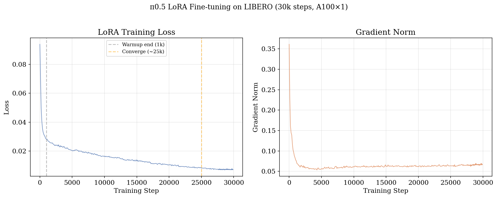
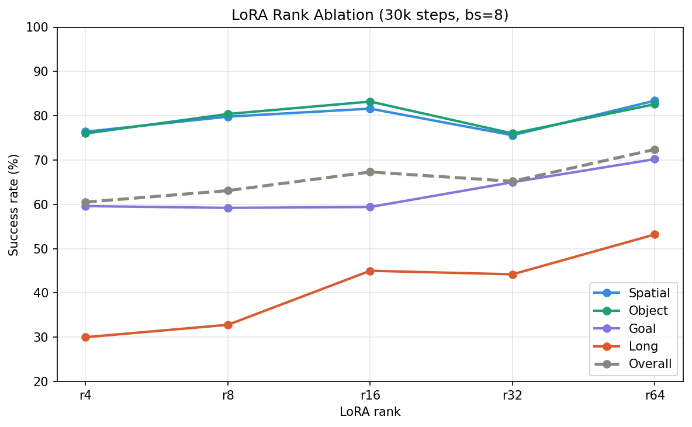
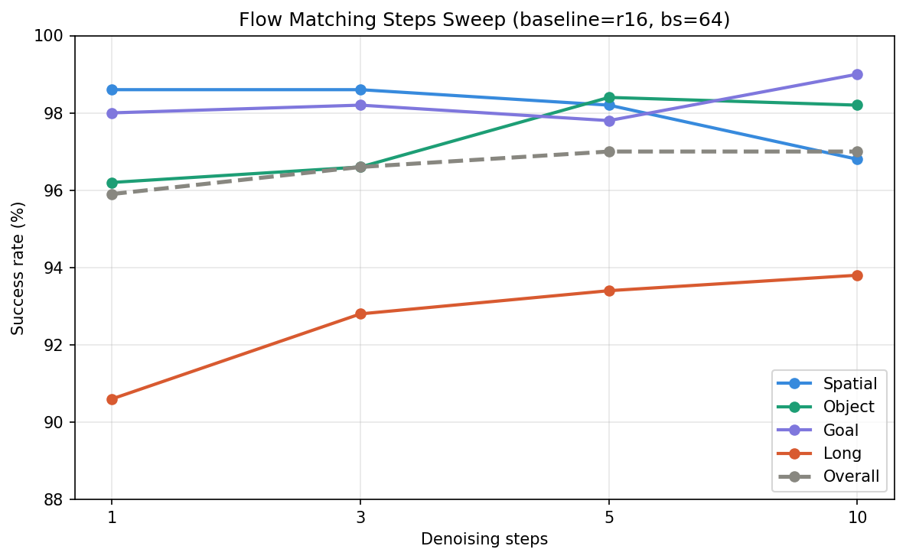
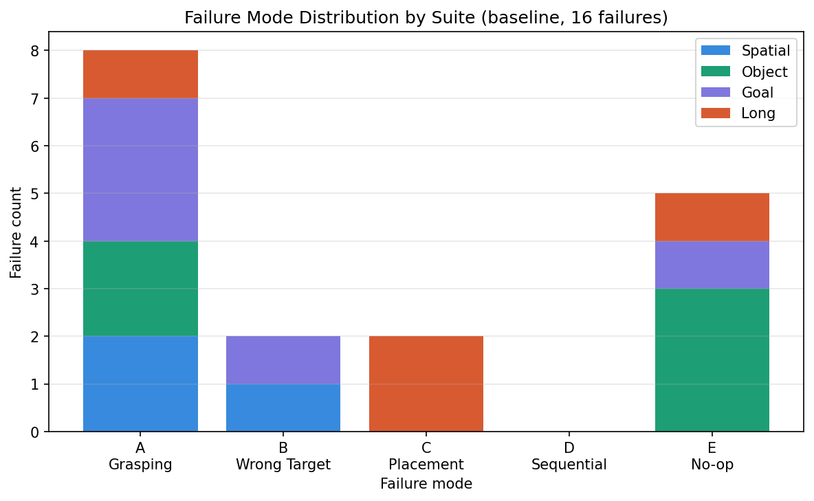

# π0.5 VLA Fine-tuning and Analysis on LIBERO Benchmark

Fine-tuning [Physical Intelligence's π0.5](https://www.physicalintelligence.company/) on the [LIBERO](https://libero-project.github.io/) manipulation benchmark using LoRA, with systematic analysis across rank ablation, flow-matching inference steps, and failure modes.

## 🔥 Highlights

- **Outperforms PI's released checkpoint**: 97.0% overall vs. 96.4%
- **LIBERO-Long**: 95.4% vs. 91.4%, the hardest 10-step sequential suite
- **Rank ablation** (r=4–64): Long is the most rank-sensitive suite (+23pp from r4→r64)
- **Flow matching analysis**: single-step inference reaches 95.9%, only 1.1pp below 10-step
- **Failure analysis**: zero sequential failures across 16 episodes, explaining the Long advantage

## 📊 Main Results

Three-way baseline on LIBERO (50 episodes per suite):

| Suite | Zero-shot (base) | PI Released | Ours (LoRA) | Δ vs PI |
|-------|:---------------:|:-----------:|:-----------:|:-------:|
| Spatial | 0.0% | 98.6% | 97.6% | -1.0% |
| Object  | 0.0% | 98.4% | 97.4% | -1.0% |
| Goal    | 0.0% | 97.2% | 97.6% | +0.4% |
| Long    | 0.0% | 91.4% | **95.4%** | **+4.0%** |
| **Overall** | **0.0%** | **96.4%** | **97.0%** | **+0.6%** |

## 🛠 Method

**Model**: π0.5 — a 3B flow-matching VLA with a PaliGemma-2B backbone and a 300M action expert.

**Fine-tuning**: LoRA adapters injected into both modules:
- PaliGemma backbone: LoRA rank=16
- Action expert: LoRA rank=32

**Training**: batch size=64, 30k steps, cosine decay (peak lr=5e-5), A100×1 (~58 hours).

**Framework**: [openpi](https://github.com/physical-intelligence/openpi) (JAX).

## 📈 Training Curve



Loss converges smoothly from ~0.09 to ~0.008 over 30k steps. Gradient norm stabilizes below 0.1 after the warmup phase.

## 🧪 Experiments

### 1. LoRA Rank Ablation

Fixed the action expert (rank=32), swept the PaliGemma backbone rank ∈ {4, 8, 16, 32, 64}. All ablation runs: bs=8, lr=6.25e-6 (linear scaling), 30k steps.

| Rank | Spatial | Object | Goal | Long | Overall |
|------|:-------:|:------:|:----:|:----:|:-------:|
| r=4  | 76.4% | 76.0% | 59.6% | 30.0% | 60.5% |
| r=8  | 79.8% | 80.4% | 59.2% | 32.8% | 63.1% |
| r=16 | 81.6% | 83.2% | 59.4% | 45.0% | 67.3% |
| r=32 | 75.6% | 76.0% | 65.0% | 44.2% | 65.2% |
| r=64 | 83.4% | 82.6% | 70.2% | 53.2% | 72.4% |



**Key finding**: LIBERO-Long is the most rank-sensitive suite (+23pp from r=4 to r=64, vs. +6~10pp for others), indicating low-rank LoRA drops long-horizon capacity first.

### 2. Flow Matching Inference Steps

Fixed the fine-tuned model (r=16, bs=64), swept denoising steps ∈ {1, 3, 5, 10}.

| Steps | Spatial | Object | Goal | Long | Overall |
|-------|:-------:|:------:|:----:|:----:|:-------:|
| 1  | 98.6% | 96.2% | 98.0% | 90.6% | 95.9% |
| 3  | 98.6% | 96.6% | 98.2% | 92.8% | 96.6% |
| 5  | 98.2% | 98.4% | 97.8% | 93.4% | **97.0%** |
| 10 | 96.8% | 98.2% | 99.0% | 93.8% | 96.9% |



**Key finding**: Overall varies by only 1.1pp across all step counts. Single-step inference reaches 95.9%, suggesting the fine-tuned action distribution is near-unimodal and requires minimal iterative refinement.

### 3. Failure Analysis

Hand-labeled all 16 failure episodes across the 4 suites into 5 categories (each counted once by its primary failure):

| Failure Type | Spatial | Object | Goal | Long | Total |
|-------------|:-------:|:------:|:----:|:----:|:-----:|
| A — Grasping precision | 2 | 2 | 3 | 1 | **8** |
| B — Wrong target | 1 | 0 | 1 | 0 | 2 |
| C — Placement | 0 | 0 | 0 | 2 | 2 |
| D — Sequential (long-horizon) | 0 | 0 | 0 | 0 | **0** |
| E — No-op / Freeze | 0 | 3 | 1 | 1 | 4 |



**Key findings**:
- **Grasping precision dominates** (8/16, 50%) — the main weakness is single-step manipulation, not high-level understanding.
- **Zero sequential failures** across all suites — directly explaining the +4.0% advantage on LIBERO-Long. The model never "forgets" task progress; failures occur on individual grasp/place actions.
- **No-op failures concentrate in Object** (3/4) — a systematic gripper-release issue in "place into container" scenes, explaining the -1.0% on Object.

#### Cascading Failures

Three failures are not single-point but cascading chains, where one error triggers the next:

| Task | Chain | Description |
|------|-------|-------------|
| pick_up_the_bbq_sauce_and_place_it_in_the_basket | A→B | Slipped during transport, then mis-grabbed the adjacent alphabet soup | https://github.com/user-attachments/assets/c1732b41-3713-48f2-b97b-749573309c4a |
| open_the_top_drawer_and_put_the_bowl_inside | A→B→A | Failed to open drawer → switched to wrong object → still couldn't recognize the drawer | https://github.com/user-attachments/assets/bdaf1188-72d4-44d7-aa60-e6071057895f |
| put_both_moka_pots_on_the_stove | A/C→C | First pot fell after unstable placement, second grabbed at wrong position | https://github.com/user-attachments/assets/d6a01570-e9d1-4e90-a59a-1d09d9233e9d |

## 🚀 Reproduction

This project is built on [openpi](https://github.com/physical-intelligence/openpi). The `configs/` directory contains the configs to be added into openpi.

```bash
# 1. Set up openpi
git clone https://github.com/physical-intelligence/openpi
cd openpi

# 2. Add the configs from this repo into openpi/src/openpi/training/config.py
#    and the gemma variants into openpi/src/openpi/models/gemma.py

# 3. Train
python scripts/train.py pi05_libero_low_mem_finetune --exp-name=lora_v1

# 4. Evaluate
python scripts/eval_libero.py \
    --checkpoint=checkpoints/pi05_libero_low_mem_finetune/lora_v1 \
    --suite=libero_spatial --num-episodes=50
```

See `configs/` for all training and ablation configurations.

## 📁 Repository Structure

```
├── configs/
│   ├── pi05_base_eval_libero.py      # zero-shot evaluation
│   ├── pi05_lora_finetune.py         # main LoRA fine-tuning
│   ├── pi05_ablation.py              # rank ablation (r4–r64)
│   ├── gemma_lora_variants.py        # gemma.py LoRA rank variants
│   └── serve_policy_flow_steps.py    # flow-matching steps control
├── assets/                           # norm stats (required for inference)
├── figures/                          # result plots
└── results/                          # evaluation logs and rollout videos
```

## 🙏 Acknowledgements

- [openpi](https://github.com/physical-intelligence/openpi) — PI's open-source training framework
- [LIBERO](https://libero-project.github.io/) — manipulation benchmark
